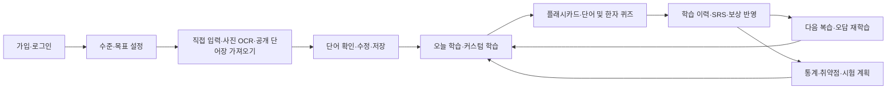

# Kotoba Loop 요구사항 정의서

작성일: 2026-09-21 · 버전: 1.0 · 기준: 현재 저장소의 코드 및 개발 계획서

## 1. 목적과 문서 기준

Kotoba Loop는 한국어 사용 일본어 학습자가 개인 단어장과 한자를 학습하고, 간격 반복(SRS), 능동 회상 퀴즈, AI 설명으로 기억을 유지하도록 돕는 웹 서비스다. 사진으로 단어를 등록하고, 학습 기록을 다음 복습과 개인화 추천에 연결하며, 게임화와 친구 대결로 꾸준한 학습을 지원한다.

이 문서는 기존 구현에서 요구사항을 역으로 정리한 기준 문서다. **‘구현 확인’은 관련 코드가 존재한다는 뜻이며, 운영 환경에서의 정상 동작이나 인수 테스트 통과를 의미하지 않는다.** 인수 기준은 이후 검증할 조건이다. 우선순위 P0/P1/P2는 이 문서가 제안하는 핵심/확장/보조 구분으로, 확정된 개발 일정은 아니다.

- 판단 우선순위: 실행 코드·스키마 → 설정 → 개발 계획서 → README.
- README의 ‘scaffold 단계’ 설명은 현재 코드와 불일치한다.
- 기존 계획의 이미지 생성·사물 인식 등은 구현 근거가 확인된 기능과 구분한다.
- 실제 배포, 외부 서비스 계정 설정, 데이터 적재량, 부하·보안·접근성 검증은 이번 문서 작성 범위에 포함하지 않았다.
- 구조와 데이터 흐름은 [서비스 아키텍처](service-architecture.md)를 참고한다.

## 2. 사용자와 권한

| 사용자 | 주요 목적 | 권한 및 제약 |
|---|---|---|
| 비회원 | 가입 및 로그인 | 개인 학습 데이터에 접근할 수 없어야 한다. |
| 학습자 | 단어 등록, 복습, 한자 학습, 목표 관리 | 본인 단어장·학습 기록을 관리하고 공개 단어장을 탐색·가져온다. |
| 대결 방장·참가자 | 같은 문제로 실시간 대결 | 방장은 시작을 제어하며 참가자는 참여한 방에서 답안을 제출한다. |
| 관리자 | 운영 보조 | 현재는 지정 이메일로 판별하는 펫 선택·레벨 조정 API가 있다. 일반적인 관리자 콘솔이나 역할 기반 권한 체계는 확인되지 않았다. |

신규 가입은 현재 `@g.yju.ac.kr` 도메인과 지정 관리자 계정으로 제한된다. 이메일 가입과 Google 최초 로그인에 적용되며, 기존 다른 도메인 계정의 로그인은 허용하는 정책이다.

## 3. 주요 이용 흐름

## 4. 기능 요구사항

아래 항목은 모두 관련 구현을 확인했다. 단, 해당 기능의 전체 인수 기준 충족 여부는 별도 검증 대상이다. 경로의 `[id]`, `[character]`, `[roomCode]`는 동적 매개변수다.

### 4.1 회원 및 개인 설정

| ID / 우선순위 | 요구사항 | 인수 기준 | 구현 근거 |
|---|---|---|---|
| FR-01 / P0 | 이메일·비밀번호 가입 및 로그인, 로그아웃을 제공한다. | 허용된 이메일로 가입할 수 있고 잘못된 인증 정보는 거부된다. 비밀번호는 해시로 저장된다. | `app/api/auth/register/route.ts`, `lib/auth.ts` |
| FR-02 / P0 | Google 로그인과 JWT 세션을 제공한다. | 최초 로그인은 가입 정책을 적용하고 기존 계정은 동일 사용자 ID로 연결한다. 보호 API는 세션 없이 호출할 수 없다. | `lib/auth.ts`, `lib/auth-registration-policy.ts` |
| FR-03 / P0 | 수준·목표 JLPT·하루 단어 수·학습 시간·목적을 설정한다. | 온보딩에서 저장한 설정을 마이페이지에서 조회·수정할 수 있다. | `app/api/users/me/onboarding/route.ts`, `components/onboarding/` |
| FR-04 / P1 | 시험 목표를 여러 개 관리하고 추천에 사용할 목표를 선택한다. | 시험일과 JLPT 목표를 저장하고 활성 목표는 사용자당 최대 하나로 유지한다. | `app/api/users/me/exam-goals/`, `lib/study/exam-plan.ts` |

### 4.2 단어장 및 등록

| ID / 우선순위 | 요구사항 | 인수 기준 | 구현 근거 |
|---|---|---|---|
| FR-05 / P0 | 개인 단어장을 생성·조회·수정·삭제하고 공개 여부를 설정한다. | 본인 단어장을 관리할 수 있고 타인의 비공개 단어장을 수정할 수 없다. | `app/api/vocabulary-books/`, `components/vocabulary/` |
| FR-06 / P0 | 단어·읽기·뜻·품사·JLPT·예문·관련 표현을 등록·수정한다. | 저장한 정보를 상세 화면에서 확인하고 관련 표현의 유의·반의·파생 관계를 관리한다. | `app/api/vocabularies/`, `lib/validations/vocabulary.ts` |
| FR-07 / P0 | 단어의 중복 여부를 확인하고 여러 단어장에 연결한다. | 중복 후보를 검토한 후 등록할 수 있고 단어장별 연결을 유지한다. | `lib/vocabulary-duplicate.ts`, `app/api/vocabularies/check-duplicates/`, `app/api/vocabularies/[id]/add-to-book/` |
| FR-08 / P1 | 태그·즐겨찾기·검색·사전 탐색을 제공한다. | 태그와 즐겨찾기로 학습 대상을 선택하고 검색 결과에서 단어 상세로 이동한다. | `app/api/tags/`, `app/api/search/`, `app/dictionary/`, `app/api/vocabularies/[id]/favorite/` |
| FR-09 / P0 | 입력 단어에 대한 AI 분석 결과를 제공한다. | 뜻·읽기·예문 등 제안을 검토·수정한 뒤 저장하며 AI 실패를 사용자에게 알린다. | `app/api/ai/analyze-word/`, `lib/ai/word-analysis.ts`, `components/vocabulary/vocabulary-form.tsx` |
| FR-10 / P1 | 교재·단어장 사진을 업로드하고 일본어 텍스트를 추출한다. | 허용 파일의 업로드 후 처리 상태와 OCR 결과를 확인하고 실패 시 재시도할 수 있다. | `app/api/vocabulary-photos/`, `lib/ocr/process-photo.ts` |
| FR-11 / P1 | OCR 텍스트에서 단어 후보를 추출·분석하고 선택한 단어를 일괄 저장한다. | 후보 수와 분석 진행 상황을 표시하고 사용자가 검토한 항목을 단어장에 등록한다. | `lib/ocr/word-batch.ts`, `components/vocabulary/photo-review.tsx`, `app/api/vocabularies/bulk/` |

### 4.3 학습과 복습

| ID / 우선순위 | 요구사항 | 인수 기준 | 구현 근거 |
|---|---|---|---|
| FR-12 / P0 | 오늘의 신규·복습·취약 학습 대상을 제공한다. | 개인 설정·학습 상태·복습일에 따라 학습 큐와 오늘 요약을 조회한다. | `app/api/study/queue/`, `app/api/study/today-summary/`, `lib/study/queries.ts` |
| FR-13 / P0 | 플래시카드에 네 단계 자기평가를 제공한다. | 모르겠음·헷갈림·기억남·쉬움에 따라 다음 복습일과 학습 상태가 갱신된다. | `components/study/flashcard-session.tsx`, `app/api/user-vocabulary/[id]/review-result/` |
| FR-14 / P0 | 단어 퀴즈 여섯 유형을 제공한다. | 일→한, 한→일, 후리가나, 객관식, 빈칸, 예문 해석을 출제하며 자료 부족 시 다른 유형으로 대체하거나 제외한다. | `lib/quiz/types.ts`, `lib/quiz/generator.ts`, `lib/quiz/session.ts` |
| FR-15 / P0 | 퀴즈 결과·응답 시간을 기록하고 SRS와 보상을 반영한다. | 동일 요청 ID의 재전송으로 학습 이력·복습 단계·경험치가 중복 반영되지 않는다. | `app/api/quiz/submit/route.ts`, `prisma/schema.prisma` |
| FR-16 / P0 | 오답노트와 재학습을 제공한다. | 오답 대상을 조회하고 재시험할 수 있으며 세션 내 오답 재출제는 문제당 1회로 제한한다. | `app/api/wrong-notes/`, `lib/study/wrong-notes.ts`, `lib/quiz/constants.ts` |
| FR-17 / P1 | 단어장·대상·문제 유형을 선택하는 커스텀 학습을 제공한다. | 선택 조건에 맞는 세션을 생성하고 학습할 대상이 없을 때 안내한다. | `components/study/custom-study-view.tsx`, `app/study/custom/` |

### 4.4 한자 및 AI 학습 지원

| ID / 우선순위 | 요구사항 | 인수 기준 | 구현 근거 |
|---|---|---|---|
| FR-18 / P1 | 상용한자 목록·상세·관련 단어·즐겨찾기를 제공한다. | 뜻·음독·훈독·학년과 관련 어휘를 조회한다. 계획상 2,136자이며 실제 DB 적재량은 별도 확인한다. | `prisma/seed-kanji.ts`, `app/api/kanji/`, `components/kanji/` |
| FR-19 / P1 | 한자 뜻·읽기·선택 퀴즈와 개인별 복습 상태를 제공한다. | 한자 세 유형을 출제하고 단어와 구분된 `UserKanji` 상태를 공통 SRS 규칙으로 갱신한다. | `app/api/kanji/quiz-queue/`, `lib/quiz/types.ts`, `lib/srs/target.ts` |
| FR-20 / P1 | 획순 표시·쓰기 연습·손글씨 검색을 제공한다. | 획순 데이터와 손글씨 인식 후보를 표시하고 외부 응답 실패나 후보 없음에 대응한다. | `components/kanji/kanji-stroke-order-card.tsx`, `app/kanji/practice/`, `lib/handwriting/google-input-tools.ts` |
| FR-21 / P1 | 문장 작성·AI 교정·상황별 예문·단어 질문을 제공한다. | 작성 문장에 피드백을 받고 선택한 상황의 예문과 단어 관련 답변을 확인한다. | `app/api/vocabularies/[id]/sentence/`, `lib/ai/sentence-correction.ts`, `lib/ai/example-by-situation.ts`, `lib/ai/word-chat.ts` |
| FR-22 / P1 | 자연어 검색·유사 단어 비교·한자 암기법을 제공한다. | 질의에 대한 후보, 단어 간 용법 차이, 한자 기억 보조 설명을 확인한다. | `app/api/ai/natural-search/`, `app/api/ai/compare-words/`, `lib/ai/kanji-mnemonic.ts` |
| FR-23 / P1 | 통계·취약점·기간별 리포트·시험 대비 계획을 제공한다. | 학습 이력 집계와 문제 유형별 정답률을 표시하고 규칙 기반 추천 수량에 AI 설명을 붙인다. | `app/api/stats/`, `app/api/study/exam-plan/`, `lib/study/exam-plan.ts` |

### 4.5 동기 부여와 소셜

| ID / 우선순위 | 요구사항 | 인수 기준 | 구현 근거 |
|---|---|---|---|
| FR-24 / P1 | 경험치·레벨·일일 퀘스트·업적을 제공한다. | 학습 행동별 보상 및 달성을 반영하고 중복 수령을 방지한다. | `lib/game/`, `lib/quest/`, `lib/achievement/` |
| FR-25 / P1 | 연속 학습·캘린더·스트릭 보호를 제공한다. | KST 날짜별 활동과 연속 학습 상태, 보호 사용 이력을 표시한다. | `lib/game/streak.ts`, `lib/study/calendar.ts`, `app/my/streak/` |
| FR-26 / P1 | 학습에 따라 성장하는 펫과 성장 이력을 제공한다. | 고양이·토끼·공룡 중 선택한 펫이 선택 이후의 레벨 상승분에 따라 성장하며 활성 펫은 최대 하나다. | `lib/pet/`, `app/api/pet/`, `prisma/schema.prisma` |
| FR-27 / P1 | 공개 단어장 탐색·가져오기와 친구 팔로우를 제공한다. | 공개 단어장을 내 단어장으로 가져오고 성공 시 가져오기 횟수를 증가시킨다. 팔로우는 승인 없는 단방향이며 자기 자신을 팔로우할 수 없다. | `app/api/vocabulary-books/community/`, `app/api/friends/` |
| FR-28 / P1 | 방 코드 기반 실시간 대결을 제공한다. | 최소 2명이 참가한 방에서 방장이 시작하고 라운드별 답안·승자·점수와 최종 결과를 동기화한다. | `app/api/battle-rooms/`, `lib/battle/`, `app/api/pusher/auth/` |
| FR-29 / P2 | 모바일·데스크톱 화면 및 PWA 설치를 지원한다. | 지원 브라우저에서 설치를 안내하고 통신 불가 시 오프라인 안내를 표시한다. 오프라인 학습·결과 동기화는 포함하지 않는다. | `components/pwa/`, `app/manifest.ts`, `public/sw.js` |
| FR-30 / P2 | 지원 브라우저에서 음성 입력을 보조한다. | 브라우저 음성 인식을 사용할 수 있는 환경에서 입력을 돕고 지원 여부를 처리한다. 발음 채점이나 TTS 학습은 별도 범위다. | `lib/hooks/use-speech-recognition.ts`, `components/ui/voice-input-button.tsx` |

## 5. 핵심 업무 규칙

| ID | 규칙 | 근거 |
|---|---|---|
| BR-01 | 학습일·일별 집계·복습일의 날짜 경계는 KST를 사용한다. DB 시간 저장 자체와 사용자 표시·날짜 경계를 구분한다. | `lib/datetime.ts` |
| BR-02 | 기본 복습 간격은 1·3·7·14·30·60·90일이다. 모르겠음은 단계 초기화 및 1일 후, 헷갈림은 단계 유지 및 2일 후다. 기억남은 현재 단계 간격 적용 후 한 단계 증가, 쉬움은 한 단계 앞 간격 적용 후 두 단계 증가하며 상한을 적용한다. | `lib/srs/engine.ts`, `lib/srs/constants.ts` |
| BR-03 | 학습 상태는 NEW·LEARNING·REVIEW·WEAK·MASTERED다. 누적 3회 이상에서 오답률 40% 이상이면 WEAK로 분류하되, 최고 단계에서 정답이면 MASTERED 판정을 우선한다. | `lib/srs/engine.ts` |
| BR-04 | 퀴즈 정답은 GOOD, 오답은 UNKNOWN 평가로 연결한다. 퀴즈와 추천 수량 계산은 규칙 기반이며 AI 단독 결정이 아니다. | `lib/quiz/constants.ts`, `lib/study/exam-plan.ts` |
| BR-05 | 사진은 최대 15MiB, JPEG·PNG·WebP·HEIC·HEIF를 업로드 허용 형식으로 정의한다. 해상도 확인 시 가로·세로 최소 480px를 적용한다. 업로드 허용과 실제 OCR 디코딩 지원은 별도로 검증해야 한다. | `lib/validations/photo-upload.ts`, `lib/storage/photo-upload.ts` |
| BR-06 | 사진 PUT 서명 URL은 5분, 미리보기 GET URL은 10분 유효하다. 서버에서 저장 경로 소유권·파일 크기·실제 형식을 다시 확인한다. | `lib/storage/photo-upload.ts` |
| BR-07 | 대결 방 코드는 6자리이며 기본 10라운드, 라운드 제한시간 15초다. 문제 생성 가능 수가 부족하면 실제 라운드 수를 줄인다. | `lib/battle/constants.ts`, `lib/battle/room-code.ts` |
| BR-08 | 공개 단어장의 인기 지표는 가져오기 횟수다. 친구는 상호 승인 관계가 아닌 단방향 팔로우다. | `prisma/schema.prisma` |
| BR-09 | 시험 추천은 진행률·남은 기간·가용 시간을 사용한다. 하루 신규 단어 최대 50개, 한자 최대 30개, 문장 최대 5개를 계산 상한으로 둔다. | `lib/study/exam-plan.ts` |

## 6. 비기능 요구사항과 검증 상태

| ID | 요구사항 / 검증 기준 | 현재 확인 사항 및 남은 검증 |
|---|---|---|
| NFR-01 보안 | 보호 API는 세션·리소스 접근 권한을 검증해야 한다. 타인 ID로 조회·변경하는 부정 테스트를 통과해야 한다. | 인증·소유권 검사 구현이 있다. 전 API 권한 검증 완료를 뜻하지 않는다. |
| NFR-02 입력·오류 | 일반 업무 API는 Zod 검증과 `{ success, data/error }` 응답 규격을 사용해야 한다. | `lib/api/handler.ts`, `lib/validations/` 확인. 인증·Pusher 등 프로토콜 전용 응답은 별도다. |
| NFR-03 데이터 정합성 | 학습 기록·SRS·보상은 트랜잭션으로 반영하고 동일 요청 재전송은 중복 처리하지 않아야 한다. | 퀴즈·플래시카드에 트랜잭션과 `request_id` 유일성 제약이 있다. 동시성 인수 시험은 별도다. |
| NFR-04 AI 안정성 | AI 출력 구조를 검증하고 타임아웃·재시도·캐시로 실패와 중복 호출을 제어해야 한다. | `lib/ai/orchestrator.ts`, `retry.ts`, `cache.ts` 확인. 기본 AI 제한시간은 30초이며 재시도를 포함한 전체 요청 시간 보장은 아니다. |
| NFR-05 OCR 안정성 | 처리 상태·실패 사유를 표시하고 재시도를 지원해야 한다. | 인식 호출 제한 50초, OCR 라우트 `maxDuration=60`. 워커 초기화·다운로드까지 포함한 전체 소요시간과 메모리 검증 필요. |
| NFR-06 실시간 정합성 | 대결 점수·승자는 서버 DB가 결정하고 재접속 시 최신 상태를 복구해야 한다. | DB 조건부 갱신과 Pusher 이벤트 후 재조회 구조. 동시 제출·네트워크 단절 시험 필요. |
| NFR-07 비용·확장성 | AI 호출량을 제어하고 캐시를 재사용해야 한다. | AI 결과는 DB에 저장하지만 호출 제한·진행 중 요청 병합은 프로세스 메모리다. 다중 인스턴스에서 전역 제한을 보장하지 않는다. |
| NFR-08 사용성 | 모바일·데스크톱에서 주요 흐름을 수행하고 로딩·빈 상태·오류를 이해할 수 있어야 한다. | 반응형 UI 존재. 브라우저별·키보드·스크린리더 인수 시험 필요. |
| NFR-09 운영성 | 앱·DB 상태를 확인하고 장애를 추적할 수 있어야 한다. | `/api/health`, `/api/health/db`와 일부 로그 확인. 모니터링·알림·백업·복원 체계는 미검증이다. |
| NFR-10 성능·가용성 | 운영 승인 전에 응답시간·동시 사용자 수·가용성·복구 목표를 합의하고 측정해야 한다. | 확정된 p95 목표·SLA·RPO·RTO와 부하 시험 결과가 없어 수치를 임의 확정하지 않는다. |
| NFR-11 개인정보 | 데이터 보존·계정 탈퇴·외부 전송·로그 정책을 명시해야 한다. | 계정·학습 이력·사진·AI 입력·필기 좌표를 취급한다. 삭제 정책과 운영 로그의 개인정보 처리 검토 필요. |
| NFR-12 채점 신뢰성 | 서비스가 보상을 결정하는 정답 기준은 클라이언트 변조에 영향을 받지 않아야 한다. | 일반 퀴즈는 제출된 `question`을 채점에 사용한다. 서버 보관 문제/서명 검증 도입 여부를 결정하고 변조 테스트해야 한다. 대결은 서버 문제 스냅샷을 사용한다. |

## 7. 주요 데이터 요구사항

| 데이터 영역 | 주요 모델 | 보존해야 할 관계·제약 |
|---|---|---|
| 사용자·목표 | `User`, `UserExamGoal`, `Friend` | 이메일 유일성, 사용자별 목표, 팔로우 쌍 유일성 |
| 단어 콘텐츠 | `VocabularyBook`, `VocabularyBookItem`, `Vocabulary`, `VocabularyMeaning`, `ExampleSentence`, `VocabularyRelatedExpression` | 단어와 단어장 다대다, 뜻·예문·관련 표현의 단어 연결 |
| 분류·개인 진도 | `Tag`, `VocabularyTag`, `UserVocabulary`, `UserKanji` | 사용자별 즐겨찾기·학습 상태·복습일·정오답 횟수 |
| 학습 이력 | `ReviewHistory`, `UserSentence` | 대상 유형·대상 ID·정오답·응답 시간·요청 ID 및 작성 문장 |
| 한자 | `Kanji`, `VocabularyKanji` | 공통 한자 데이터와 어휘의 다대다 연결 |
| AI·사진 | `AIAnalysis`, `PhotoUpload`, `PhotoOcrResult` | 사용자·분석 유형·입력 참조별 캐시, 사진 소유권, 사진별 OCR 결과 |
| 동기 부여 | `UserGameProfile`, `Quest`, `UserQuestProgress`, `Achievement`, `UserAchievement`, `StreakFreezeLog`, `UserPet` | 개인별 보상·달성·보호·성장 상태 |
| 대결 | `BattleRoom`, `BattleParticipant`, `BattleRound`, `BattleAnswer` | 방별 참가자, 라운드 번호, 라운드별 사용자 답안의 유일성 |

`ReviewHistory`의 대상 연결은 `target_type + target_id` 구조다. 단어·한자 대상 각각에 대한 일반 FK가 있는 것으로 해석해서는 안 된다. 활성 시험 목표·활성 펫 최대 하나 규칙은 API 트랜잭션에서 관리하며 DB 부분 유일 인덱스는 확인되지 않는다.

## 8. 범위 제외 및 결정 필요 사항

- 자동 이미지 생성, 카메라 사물 인식, 여행 사진 기반 학습은 기존 계획에 있어도 이번 코드 확인에서 완성된 기능으로 분류하지 않는다.
- 결제·유료 구독, 알림 푸시, 완전한 오프라인 학습·동기화, 일반 관리자 콘솔은 본 정의서의 확정 기능 범위 밖이다.
- HEIC/HEIF 사진의 OCR 성공 여부, 한자 획순 데이터 커버리지, 브라우저 음성 입력 지원은 실환경 확인이 필요하다.
- Google Input Tools 손글씨 인식은 코드 주석상 비공식 인터페이스를 사용한다. 장기 지원 방침과 대체 수단을 결정해야 한다.
- 가입 제한 유지 기간, 학습 데이터 보존·탈퇴 정책, 성능·가용성 목표, 개인정보 처리 및 외부 서비스 이용 정책을 확정해야 한다.
- 일반 퀴즈 채점 신뢰성, 요청 ID 재사용 시 사용자·대상 일치 검증, 다중 인스턴스 호출 제한을 운영 전 검증 항목에 포함한다.

## 9. 인수 검증 시나리오

| 시나리오 | 연결 요구사항 | 완료 기준 |
|---|---|---|
| 신규 학습자 첫 학습 | FR-01~03, 05~06, 12~15 | 가입 → 목표 설정 → 단어 저장 → 학습 → 복습일·보상 확인 |
| 사진 단어장 등록 | FR-10~11, BR-05~06 | 업로드 → OCR → 후보 검토 → 일괄 저장; 크기 초과·잘못된 형식·시간 초과도 확인 |
| 재전송 및 권한 | FR-15, NFR-01·03·12 | 동일 제출 중복 반영 없음; 타인 데이터 접근·문제 변조·다른 대상의 요청 ID 재사용 차단 |
| 한자 학습 | FR-18~20 | 검색 → 상세·획순 → 퀴즈 → 개인 진도·복습일 갱신 |
| 공유 및 대결 | FR-27~28, NFR-06 | 공개 단어장 가져오기 → 2인 방 입장 → 동시 답안 → 일관된 결과 → 재접속 복구 |
| 목표·게임화 | FR-04, 23~26 | 활성 목표별 추천 확인 → 퀘스트·업적·스트릭·펫 변화 검증 |
| 제한된 연결 | FR-29, NFR-04~05 | 외부 서비스 실패 시 안내·재시도, 오프라인 진입 시 안내 화면 제공 |

## 10. 기준 자료

- [개발 계획서](../%23%20AI%20기반%20일본어%20단어·한자%20학습%20웹%20서비스%20개발%20계획서.txt)
- [패키지와 실행 스크립트](../package.json)
- [DB 스키마](../prisma/schema.prisma)
- [환경변수 예시](../.env.example)
- [서비스 아키텍처 및 상세 흐름](service-architecture.md)

실제 비밀키와 운영 데이터는 문서화에 사용하지 않았다.
