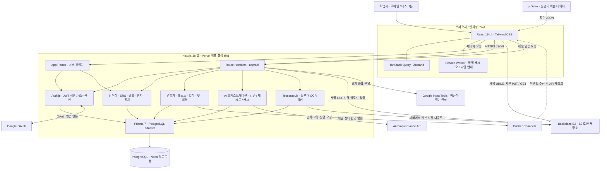
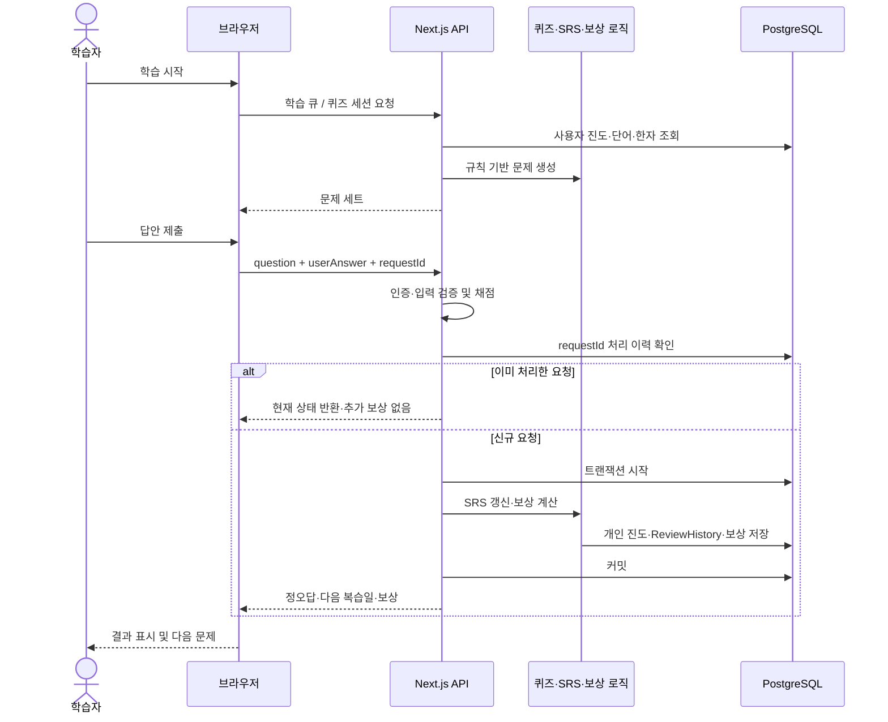
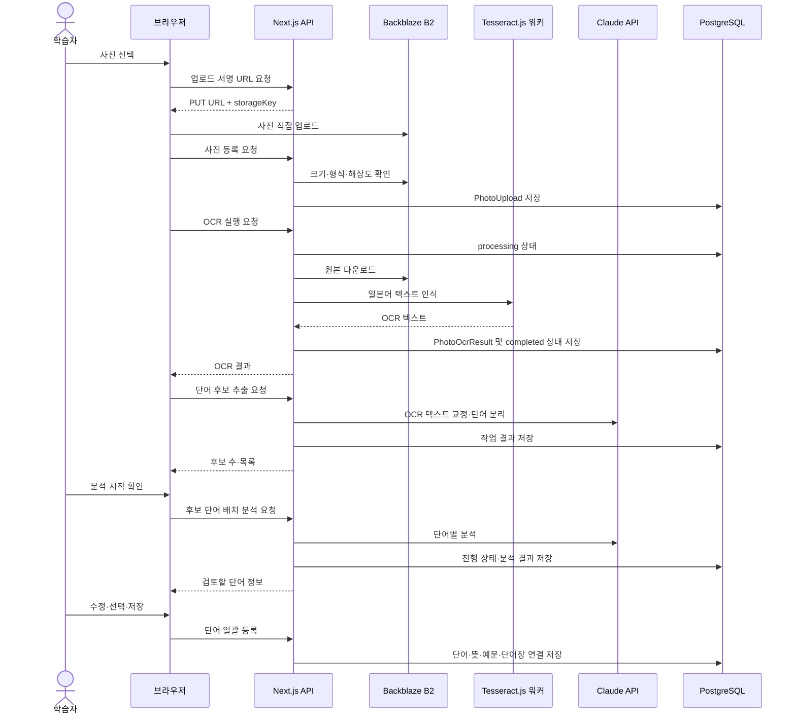
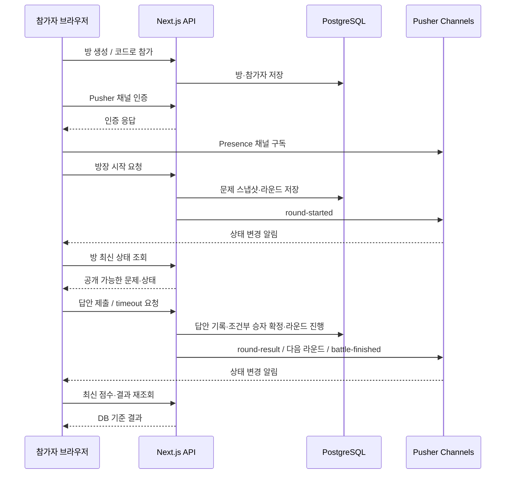
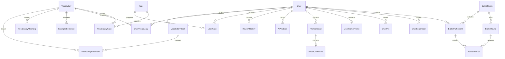

# Kotoba Loop 서비스 아키텍처

작성일: 2026-09-21 · 버전: 1.0 · 현재 코드 기준

## 1. 구조 개요

**하나의 Next.js 애플리케이션에 화면·API·도메인 로직을 통합한 모듈형 모놀리스**다. PostgreSQL을 영속 저장소로 사용하고 AI, 파일 저장, 실시간 메시징, 로그인 등을 외부 서비스와 연동한다. 모듈별로 분리된 디렉터리가 있어도 독립 배포되는 마이크로서비스를 의미하지 않는다.

Vercel의 `sin1` 리전 설정과 Neon을 가리키는 환경변수 예시 주석이 있다. 아래 배포 구성은 **저장소가 의도한 구성**이며 실제 운영 배포와 계정 설정은 확인하지 않았다. DB의 코드상 확정 사항은 PostgreSQL 사용이다.

## 2. 서비스 구성도

실선은 주요 호출·데이터 흐름, 점선은 외부 보조 데이터 및 이벤트 전달이다. 서버에서 DB·LLM·스토리지 비밀키를 관리한다.

원본을 별도 편집할 때는 [Mermaid 구성도 파일](service-architecture.mmd)을 사용한다.

## 3. 구성 요소와 책임

| 계층 | 기술·코드 | 책임 |
|---|---|---|
| 사용자 화면 | `app/`, `components/`, React 19, Tailwind CSS 4 | 단어장, 학습, 한자, 통계, 커뮤니티, 대결 및 펫 화면 |
| 서버 렌더링 | Next.js App Router 서버 페이지 | 세션 확인·초기 데이터 조회·페이지 구성; 모든 조회가 HTTP API를 경유하는 구조는 아니다. |
| 클라이언트 상태 | TanStack Query 5, Zustand 5 | API 응답 캐시·갱신과 학습 세션·선택값·알림 등 UI 상태 |
| API·입력 검증 | `app/api/`, `lib/api/`, `lib/validations/`, Zod 4 | 요청 파싱, 인증·소유권 검사, 업무 처리와 표준 오류 응답 |
| 인증 | `lib/auth.ts`, Auth.js/next-auth 5 beta, bcryptjs | 이메일·Google 로그인, JWT 세션, 비밀번호 검증 |
| 학습 도메인 | `lib/srs/`, `lib/quiz/`, `lib/study/`, `lib/kanji/` | 복습일·상태 전이, 출제·채점, 큐·리포트·시험 계획 계산 |
| 동기 부여·대결 | `lib/game/`, `lib/quest/`, `lib/achievement/`, `lib/pet/`, `lib/battle/` | 보상·성장·연속 학습, 방·라운드·승자 관리 |
| AI 연동 | `lib/ai/`, Anthropic SDK | 분석·검색·문장 교정·설명, 출력 검증·재시도·결과 캐시 |
| 사진·OCR | `lib/storage/`, `lib/ocr/`, AWS S3 SDK, Tesseract.js 7 | 서명 URL·업로드 검증, 서버 일본어 OCR, 후보 단어 배치 분석 |
| 영속 데이터 | Prisma 7, pg adapter, PostgreSQL | 사용자·콘텐츠·진도·학습 이력·AI 결과·대결 상태 |
| 실시간 이벤트 | `lib/pusher/`, Pusher Channels | 서버 상태 변경 통지와 참가자 presence; 점수의 원본 저장소는 DB |
| 보조 외부 연동 | Google Input Tools, jsDelivr, 브라우저 음성 인식 | 필기 인식, 획순 데이터, 지원 브라우저의 음성 입력 |

기술 버전은 저장소 `package.json`의 선언을 요약한 값이다. 실제 설치 버전·외부 서비스 상품 사양을 검증한 자료는 아니다.

## 4. 주요 처리 흐름

### 4.1 일반 퀴즈와 복습

현재 일반 퀴즈는 문제 객체를 클라이언트에 반환하고 제출받은 `question`을 채점에 사용한다. **서버가 채점 함수를 실행한다는 사실만으로 정답 데이터의 무결성이 보장되지는 않는다.** 서버 보관 문제 식별자 또는 서명 검증은 추가 검토 사항이다. `request_id` 유일성 제약으로 중복 반영을 방지하지만 재사용 시 사용자·대상 일치 검증도 별도 점검해야 한다.

### 4.2 사진에서 단어장까지

- 사진 바이너리는 브라우저에서 B2로 직접 전송한다. OCR 시에는 서버가 다시 내려받는다.
- OCR은 외부 OCR SaaS가 아니라 Next.js Node 런타임에서 구동하는 Tesseract 워커다. 일본어 학습 데이터는 `public/tesseract/jpn.traineddata`에 포함된다.
- OCR·분석 실행은 HTTP 요청으로 진행한다. 작업 상태 저장과 진행 조회 API가 있어도 별도 메시지 큐나 독립 배치 워커가 구현된 것은 아니다.
- OCR 실패는 `failed` 상태와 오류로 처리하고 재시도할 수 있다. 인식 시간 제한은 50초이며 워커 초기화·사진 다운로드까지 포함한 종단간 보장은 아니다.
- Claude에 보내는 사진 경로의 주요 입력은 OCR 텍스트와 단어 후보다. 이 흐름을 원본 사진을 Claude Vision에 직접 보내는 구조로 해석하지 않는다.

### 4.3 실시간 대결

서버가 대결 문제 스냅샷과 정답을 보관하고 공개 응답은 직렬화 로직을 거친다. Pusher 이벤트는 재조회 신호이며 DB 상태가 기준이다. 재구독 성공 시에도 API를 재조회한다. 라운드 진행은 답안·timeout 등 요청과 연결되므로 독립 스케줄러가 자동으로 모든 방을 진행하는 것으로 가정하지 않는다.

## 5. 핵심 데이터 관계

다음은 서비스 이해를 위한 부분 ERD다. 전체 컬럼·모든 모델은 [Prisma 스키마](../prisma/schema.prisma)가 기준이다.

단어 콘텐츠(`Vocabulary`)와 개인 진도(`UserVocabulary`)를 분리한다. 한자 역시 공통 콘텐츠와 사용자별 진도를 분리한다. `ReviewHistory`의 단어·한자 대상은 유형과 ID로 표현되어 해당 두 테이블과의 FK 관계선은 그리지 않았다. 펫·시험 목표의 활성 개수 제한은 API 로직이 관리한다.

## 6. 배포·외부 의존성과 경계

| 항목 | 저장소에서 확인한 설정 | 운영 확인 필요 사항 |
|---|---|---|
| 애플리케이션 | Next.js, `vercel.json`의 `sin1` | 실제 프로젝트·도메인·배포 상태, 함수 시간·메모리 한도 |
| DB | `DATABASE_URL`, Prisma PostgreSQL adapter; 예시 주석은 Neon | 실제 제공자·리전·연결 풀·백업·복원 |
| AI | `LLM_API_KEY`, `AI_MODEL`, `AI_TIMEOUT_MS`, `AI_MAX_RETRIES` | 계정에서 사용 가능한 모델명·호출 한도·비용. 코드의 모델 문자열은 외부 제공 여부를 보증하지 않는다. |
| 저장소 | `STORAGE_*`, B2 S3 호환 endpoint | 브라우저 업로드 CORS, 버킷 권한·수명주기·실제 크기 제한 |
| 인증 | `AUTH_SECRET`, `AUTH_GOOGLE_ID`, `AUTH_GOOGLE_SECRET` | OAuth 리디렉션 URI·가입 도메인 정책·로그 정책 |
| 실시간 | `PUSHER_*`, `NEXT_PUBLIC_PUSHER_KEY/CLUSTER` | 채널 인증·연결 수·이벤트 한도·재접속 동작 |
| 획순·손글씨 | jsDelivr JSON, Google Input Tools 호출 | 데이터 커버리지·비공식 인터페이스 변경·장애 대응 |
| PWA | manifest, Service Worker | 설치 지원과 오프라인 안내. 개인 학습 API·페이지 데이터 캐시 및 오프라인 동기화는 미구현 범위다. |

브라우저 공개 설정인 Pusher key/cluster와 서버 전용 secret을 구분한다. DB·LLM·스토리지 자격 증명을 클라이언트에 포함하면 안 된다. 이번 문서에서는 실제 비밀값을 읽거나 기록하지 않았다.

## 7. 운영 전 확인할 구조적 제약

1. **서버리스 확장 시 호출 제한:** AI 결과 캐시는 DB에 있지만 호출 제한과 진행 중 요청 병합은 인스턴스 메모리다. 여러 인스턴스에 걸친 전역 제한이 필요하면 공용 저장소 기반 제어를 검토한다.
2. **요청 내 OCR 처리:** 사진 다운로드·워커 초기화·인식을 한 요청에서 수행한다. 큰 이미지와 동시 요청에 대한 메모리·시간 측정이 필요하다. 독립 큐·워커는 필요성이 확인될 때 도입할 확장안이다.
3. **퀴즈 신뢰 경계:** 일반 퀴즈의 제출 문제 객체와 서버 정답 기준을 분리하는 설계를 검토한다. 대결의 서버 보관 구조와 구분한다.
4. **외부 의존 실패:** AI·B2·Pusher·필기 인식·획순 데이터 장애가 각각 어떤 사용자 흐름을 막는지 검증한다.
5. **배포 정합성:** DB 마이그레이션·한자/JLPT 데이터 시딩·비밀키 등록·OAuth 및 CORS 설정을 운영 환경에서 확인해야 한다.

이 항목들은 현재 구현에 추가되어 있다는 뜻이 아니라 운영 검증과 향후 설계를 위한 확인 목록이다. 기능별 인수 기준은 [요구사항 정의서](requirements.md)에 정리했다.
